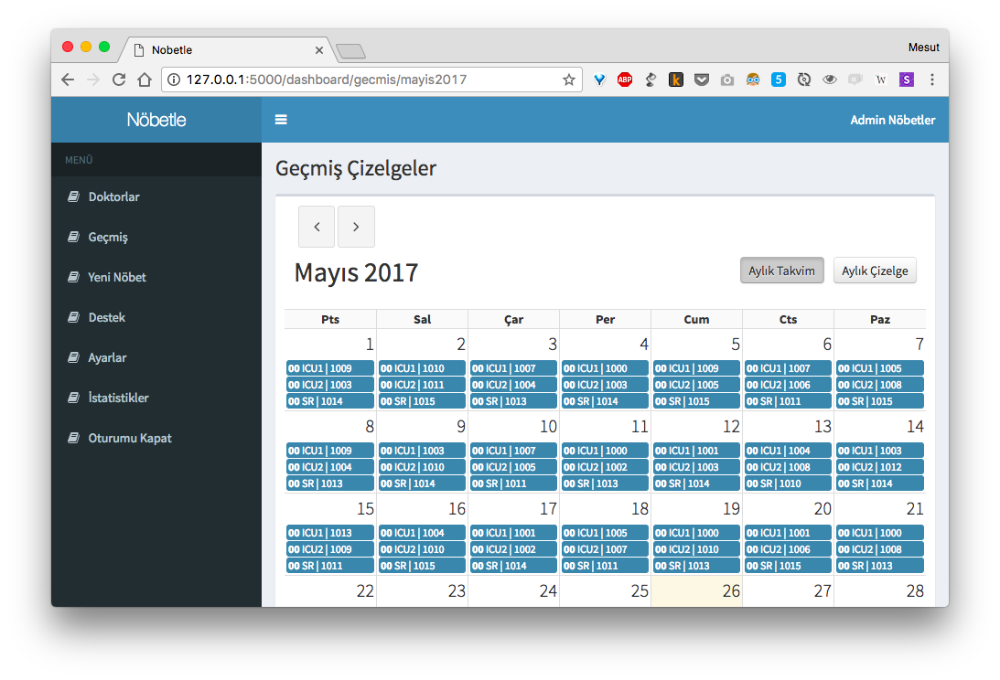
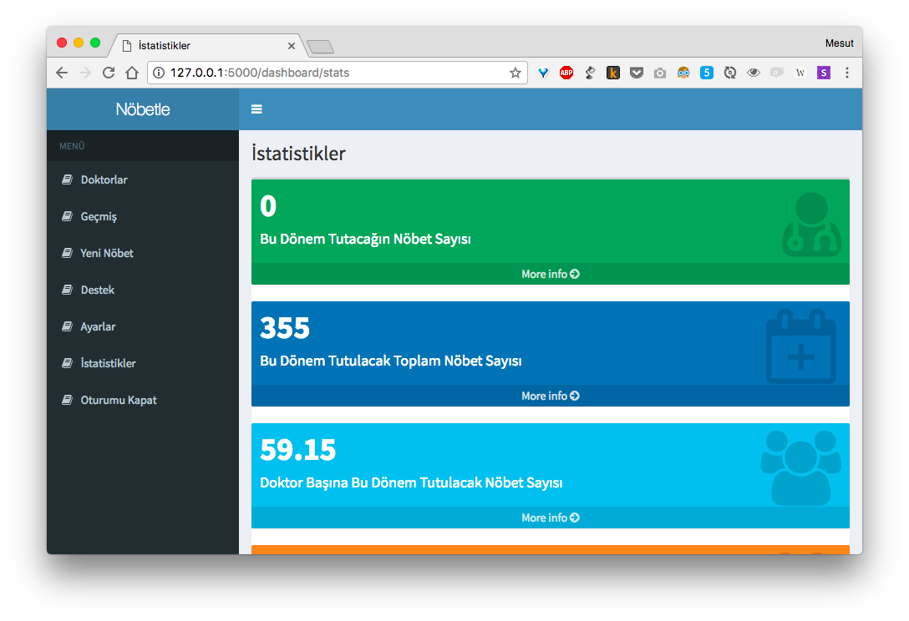

# Nobetle

Nobetle, is a shift scheduling web app for hospital departments.



_Sample Schedule Screen_

## Properties of Nobetle

### Usage Properties

- User Interface Language: Turkish

### Technical Properties of Nobetle

- Written for Python 3
- MVC (Model-View-Controller)
- Data retrieved from and saved to MySQL Database

## Required Following Works
- Schedule script's static codes should be coded dynamically.


_Sample Statistics Screen_

## Implementation

Nobetle require two working service:

1. Main script ```nobetle.py``` as service
2. MySQL Database Service

__Steps__

1. [Get Source Code](#1-get-source-code)
2. [Install Python 3](#2-install-python-3)
3. [Install Requirements](#3-install-requirements)
4. [Install MySQL Database](#4-install-mysql-database)
5. [Create Tables](#5-create-tables)
6. [Configure Services](#6-configure-services)

### 1. Get Source Code

You can get Nobetle code by two options;

1. [Download](https://github.com/imesut/nobetle/archive/master.zip) the Code
1. Clone the Repo
    - ```git clone https://github.com/imesut/nobetle.git```
    - ```cd nobetle```

### 2. Install Python 3

If Python 3 didn't installed into your system, download Python 3 from official Python [Download page](https://www.python.org/downloads/)

### 3. Install Requirements

To install requirements;

```pip3 install -r requirements.txt```

### 4. Install MySQL Database

#### 1. On Linux Systems

1. Run these commands to install MySQL
 - ```sudo apt-get update```
 - ```sudo apt-get install mysql-server```

2. To determine a root password for MySQL; ```sudo mysql_secure_installation```

3. Initialize MySQL: ```sudo mysql_install_db```

4. Ensure MySQL service is running: ```mysql.server start```

5. Connecting to MySQL: ```mysql -h localhost -u root -p```

6. Then enter your MySQL root password.

#### 2. On MacOS Systems

1. Instal MySQL via [.pkg installer](https://dev.mysql.com/doc/refman/5.6/en/osx-installation-pkg.html)

2. Ensure MySQL service is running: ```mysql.server start```

3. Connecting to MySQL: ```mysql -h localhost -u root -p```

4. Then enter your MySQL root password.


### 5. Create Tables

Table creation can be directly done by executing ```create_tables.sql``` file.

To execute the file at MySQL shell;

```source create_tables.sql```

First user of Nobetle is owner user. And its database equivalent can be added to database by insert into method or basicly executing ```first_user.sql``` file.

To execute the file at MySQL shell;

```source first_user.sql```

### 6. Configure Services
